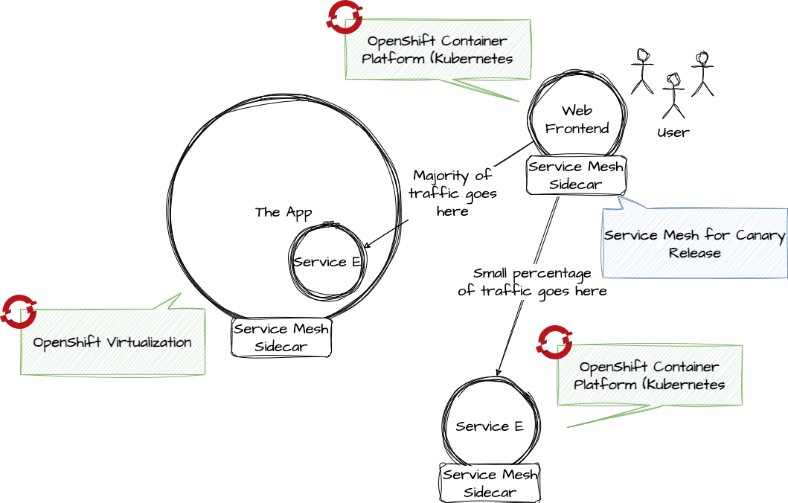

# App modernization with OpenShift Virtualization and Service Mesh

In this lab we modernize a monolithic application. First we move the monolith to OpenShift Virtualization, then we apply the **Strangler pattner** and move one bounded context into a microservice. We install and configure Service Mesh to make a **Canary Release** of the new microservice.

This is what we want to achieve:



Disclaimer: The monolith isn't a real legacy app. But you could use exactly the same steps to modernize your big old Java application.

## Instructions

You'll find instructions how to setup the infrastructure and how to run the lab here:

* [Infrastructure prep guide](README_INFRA_PREPARE.md)
* [Lab guide](README_LAB_INSTRUCTION.md)

## Develop

Run in app folder:

```bash
python3 -m venv .venv
source .venv/bin/activate
```

In VSCode: Cmd-Shift-P > Select Python Interpreter > Enter Interpreter Path -> APPFOLDER/.venv/

### Install dependencies

Run in app folder:

```bash
pip install -r requirements.txt
```

### Run app

In app folder:

#### Monolith
`python main.py`

#### Webapp

`npm run dev`

#### Microservice

`quarkus dev`