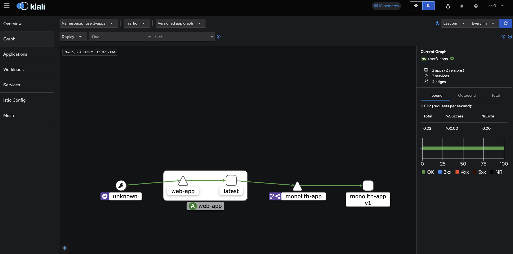
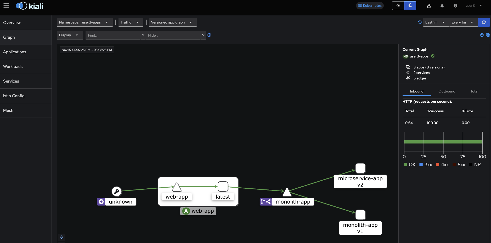

# Instruction for the workshop

## Login
> **_NOTE:_** It's good to have `oc` command line tool pre-installed.

Participants can use the [workshop link](https://catalog.demo.redhat.com/workshop/nek9j5) for the user registration on OpenShift.

Once users received login information for OpenShift cluster, go ahead and login to OpenShift cluster either via web console or via terminal

## 1. Monolith application deployment

> **_NOTE:_** Make sure you are logged in to OpenShift at your current terminal session.

Command:
```
# switch to the target namespace for deployment
oc project userX-apps

# create the deployment manifests on OpenShift
oc apply -f k8s-1 -n userX-apps
```

With the above command, the monolith application will be deployed in the virtual machine (see [monolith-app.yml](https://github.com/nikolaus-lemberski/summit-2024-app-mod-lab-simple/blob/main/k8s-1/monolith-app.yml)) and a web application will be deployed using a pre-built container image (see [web-app.yml](https://github.com/nikolaus-lemberski/summit-2024-app-mod-lab-simple/blob/main/k8s-1/web-app.yml) on OpenShift.

You can run the following command to check the pod status:
```
oc get pods -n userX-apps
```

## 2. Enable automatic sidecar proxies 

Envoy proxies are deployed as sidecars and run in the same pod as services with the applications.

It's done by adding the following annotation to the deployments:
```
sidecar.istio.io/inject: "true"
```

in the workshop, simply run:
```
oc apply -f k8s-2 
```

> **_NOTE:_** We need to manually delete the virt-launcher pods in order to have the sidecar container deployed - `oc delete pods <pod-name>`

You can run the following command to check the pod status:
```
oc get pods
```
We can see there is additional container in the ready state for each pod.

In this stage, `DestinationRule` and `VirtualService` will be created. `VirtualService` defines a set of traffic routing rules to apply when a host is addressed, while `DestinationRule` defines the policies that apply to the traffic for a service after the routing has occured.

Here we set a simple route rule for the monolith-app version 1.

## 3. Microservice application deployment
In this step, we will deploy `service-b` as a microservice simply by running:
```
oc apply -f k8s-3
```

We don't route any traffic to microservice yet. On Kiali we can see the traffic graph as the following:




## 4. Canary release with Service Mesh

In Canary Deployments, newer versions of services are incrementally rolled out to users to minimize the risk and impact of any bugs introduced by the newer version. To begin incrementally routing traffic to the newer version of the frontend service, we can modify the weight of the `VirtualService` rule: 
```
oc apply -f k8s-4
```

```
  route:
    - destination:
        host: monolith-app
        subset: version-v1
      weight: 80
    - destination:
        host: monolith-app
        subset: version-v2
      weight: 20
```
Now we can send requests to `/service-b` endpoints, we can check the traffic graph on Kiali:

